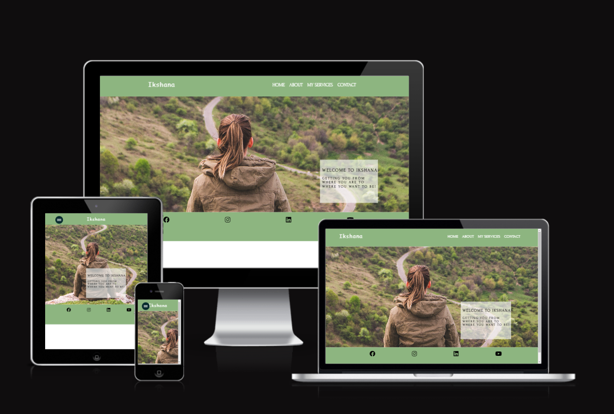
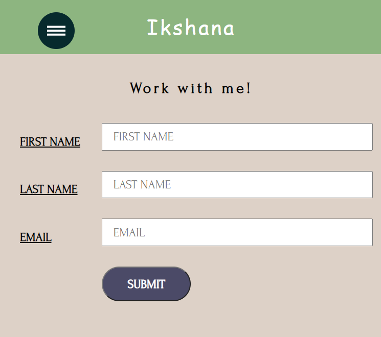

# Ikshana

My project is my first foray into programming after 20 years. Things have really changed but I am enjoying the learning and the challenges in my goal to become a software developer. 

I have found learning CSS extremely intersting and rewarding. I know i have just scratched the surface of its capabilities but I have done my best with my fledgling knowledge to build this website.

This project is based on a life coaching service named Ikshana. Ikshana meaning: *sight, care and superintendence but also refers to eye, sight, seeing, viewing, aspect, caring for, looking after, regarding.*

 This life coaching service offers support and guidance in reaching personal and professional goals in particular for individuals who find themselves in a situation where a loved one is afflicted with a disability. The serrvice provides guidance, empathy, accountability and support in providing clarity and focus and achieviving goals to individuals engaging with the service.

 You can find a link to the live website [here](https://nscotty.github.io/project1/).

## Features

### Existing Features

* Navigation Bar
  * Featured on all pages of the website the reposive navigation bar allows users to easily and seamlessly navigatte to all areas of the site. 
   * Allows users to move from one page to another without having to use the back browser button 
   
   
    * The navbar is fully responsive and changes to a hamburger style when screen sizes go to 800px or below allowing ease of navigation with minimal space constraints.
  
  
  
 * Landing Page
    * The landing page is an image of a person sitting on a hill in front of beautiful scneney and a winding path below. I really like this image as it can be perceived either as resting and admiring the end of a journey or contemplating the start of an exciting adventure. I wanted the image to be ignite users imaginations and inspire them that life coaching and self exploration can be an exciting, rewarding adventure as well as a challenge ans accomplishment.
    * The landing page also has zoom animation which further lends the page appeal to capture the users interest.
 

* About Me page
  * The about me page talks about Carolines background and her journey to becoming a life coach. it features a picture of Caroline and a description of who she is 
  * A **read more** link was introduced on this page as there is a lot of text and this method allows the user to read more or less as they wish.
  

* Services Page
  * On this page we describe the services provided with Ikshana coaching.
  * Images relevant to the contant were used to reflect the services provided and help to engage the user.

  
  

  * Text and images are displayed in column format on smaller screens and side by side on larger screens.

* Work With Me page
  * This page is designed to make it easy for the user to get in touch. On smaller screens the contact form takes the wisth of the page whereas on larger screens flex was used to stack the contact me section alongside the form.
  * The form is fully validated and the user must enter the correct details for the form.
  
  

 
 
 

* Footer
  * The footer element is designed to provide easy navigation to the social networks of Ikshana coaching for the user. 
  * It is fully responsive and when cliked each link opens in a new window allowing the user to easily navigate back to the webpage.

  

  * Contact Page

    * The contact page features a fully responsive form. The form at full screen shows the form labels to the left of the input fields

    

    * Between 500 - 600px the form labels appear above the input boxes saving space without compromising the form:

    

    * When screen sizes go below 500px the form labels disappear altogether and the user is guided by the input box placeholder instead. This saves space on the smallest screens while still guiding the user.

    

  * Contact sidebar

   * The contact sidebar contains contact details for the life coach. It appears under the form in screens under 800px:

    

   * At screens larger than 800px the contact page appears to the right of the contact form:

    

    ## Design 

    * Colours

      * For this project I chose an earthy contrasting colour scheme which i felt complemented the theme and added visual appeal for the user without distracting from the content. 

      * I used the coolor website to find my colour scheme.

      

## Features left to implement

A feature I would like to implement is a **booking system** allowing users to see a calendar of available times and dates to book an appointment. This is outside of my resources and scope for this project but is something I would like to implement in the future.
A **blog page** is something that would also be very useful in a life coaching website and is something I would like to implement when I am further on in my learning.

## Technologies Used

* HTML
  * HTML was the basic building block of this website.

* CSS
  * CSS was used to add colour, style and more structure to the site.  

* Javascript
  * A small bit of Javascript was used to create thye hamburger navigation menu.

* Google Developer Tools
    * Used to check for responsivess and to fix bugs in the site.

* Font Awesome
  * Used for social media icons.

* Google Fonts
  * Used to source styles of fonts used in the project.

* Gitpod
  * Used as the main development environment throughout the site.

* GitHub
  * Used to store code and deploy my project.

* Codepen
  * Used to practice coding

* Balsamiq 
   * Used to create wireframes for my project.                 

## Testing

* HTML Validation

The code was passed through the W3C Markup Validator and returned no errors

* CSS Validation

The code was passed through the CSS Validation Service and no errors were found

* Manual Testing

  * Each page feature was tested individually and the results can be seen 

* Lighthouse 

I used Lighthouse within the Chrome Developer Tools to test the performance, accessibility, best practices and SEO of the website.

  * Desktop Results:

    * Home page:
    Desktop

    

    Mobile

    

    * About Me page:

    Desktop

    

    Mobile

    

    * Services page

    Desktop

    

    Mobile

    

    * Contact page

    Desktop

    

    Mobile

    

    The lighthouse reports for performance were affected by images being in .png and .jpg format, which is something I will consider changing in the future to overcome this performance issue.

    ### Further Testing

    * The project was tested on the following browsers with success, Google Chrome, Safari and Firefox.

    * Project was manually tested on an iPhone 11 and an Ipad mini with success.

    * I used Google Chrome Developer Tools throughout the project to test responsiveness and to debug.

    * Google Chrome Tools emulated devices such as:

        * Apple iPad
        * Apple iPhone X
        * Apple iPhone 6/7/8 Plus
        * Apple iPhone 6/7/8
        * Apple iPhone 5/SE
        * Google Pixel 2/2 XL
        * Samsung Galaxy S5
        * Motorola G4
        * Microsoft Surface Duo
        * Apple iPad Pro

  ## Known bugs and fixes

  I dealt with many bugs while working on my project but was able to resolve most. Here are the details of what I encountered:
  
  * My styling was completely absent in my live website. This occured because I had implemented absolute file path in my css style sheet link.
    I corrected this by making my file path relative.
  * Images would not load on my live website. This occured as I had places my images folder outside of my assets folder. I corrected this but my images still would not load. Again this occured because of absolute file paths. I amended this by making all my image filepaths relative.

  * My gitpod console stopped updating my commits because of work done remotely. This occured because I wrote some of my readme file within GitHub instead of within Gitpod and needed to pull the file in to update it.

  

  This was a worrying error for me as I was afraid my work would not be saved but it got resolved with help from the gitpod channel in the slack coomunity.

  * Lighthouse performance score is sub optimal for my site pages. I will look at methods to amend this.

  * There was a gap between my footer element and the main part of my pages which does not look good. I amended this by changing the vh to minimum 100vh in the body.

  

## Deployment

### Github

This project was deployed sing GitHub pages with the following process:

**Deploying a GitHub repository via GitHub Pages**

1. In your *Repository section*, select the Repository you wish to deploy.
2. In the top horizontal Menu, locate and click the *Settings* link.
3. Inside the Setting page, around halfway down locate the GitHub Pages Section.
4. Under *Source*, select the None tab and change it to *Master* and click *Save*.
5. Finally once the page resets scroll back down to the GitHub Pages Section to see the following message *"Your site is ready to be published at (Link to the GitHub Page Web Address)"*. It can take time for the link to open your project initially, so please don't be worried if it does not load immediately.

**Forking the GitHub Repository**

You can fork a GitHub Repository to make a copy of the original repository to view or make changes without it affecting the original repository.

1. Find the GitHub repository you want to fork.
2. Click the Code button.
3. Copy the link shown.
4. In Gitpod, change the directory to the location you would like it to be.
5. Type git clone, and paste the link you copied in step 3.
6. Press Enter to have the clone created.

## Credits

### Code

* **Kevin Powell** for learning about CSS and Flexbox and hamburger navigation bar

  * Source [Kevin Powell](https://www.youtube.com/@KevinPowell)

* **Study Web Today** channel on youtube helped me create the readmore button on my ***About Me*** pages

* Source [Study Web Today](https://www.youtube.com/watch?v=2XJ-HKN9DAo&list=PLzg2IM5UwI_2Z04ds3jEpAAN3mBWay-RW&index=15)  

* **Steve Griffith** helped in creating responsive form on my Contact page

  * Source [Steve Griffith](https://www.youtube.com/@SteveGriffith-Prof3ssorSt3v3)

* Code Institute Slack Team for helping me out when pieces of code werent working

## Content

* I got the information for the site from Caroline Lawless life coach .

* I used [Coolor](https://coolors.co/) for the colour palette.

## Media

* I used [Unsplash](https://unsplash.com/) for the images for the webpage

* [Font Awesome](https://fontawesome.com/kits/b8dbacb959/use) wasa used for social media icons

* I found all of my fonts on [Google Fonts](https://fonts.google.com/)

  

